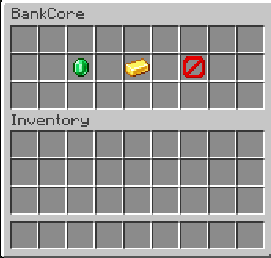

# BankCore

A modern banking and economy plugin built for Paper 26.2.

BankCore provides persistent player balances, secure transfers, transaction history, administrative balance management, and an interactive bank GUI.

## Features

- Persistent SQLite accounts
- UUID-based player storage
- `/balance` and `/bal`
- Player-to-player payments with `/pay`
- Interactive `/bank` GUI
- Persistent transaction history
- `/bankhistory`
- Admin balance management
- Configurable starting balance
- Permission-based access
- Automated JUnit tests
- Tested on Paper 26.2 with Java 25

## Screenshots

### Bank GUI

### Balance Command

## Commands

| Command | Description |
| --- | --- |
| `/balance` | View your balance |
| `/bal` | Alias for `/balance` |
| `/pay <player> <amount>` | Send money to another player |
| `/bank` | Open the BankCore GUI |
| `/bankhistory` | View recent transactions |
| `/bankadmin set <player> <amount>` | Set a player's balance |
| `/bankadmin add <player> <amount>` | Add money to a player's balance |
| `/bankadmin remove <player> <amount>` | Remove money from a player's balance |

## Permissions

| Permission | Description |
| --- | --- |
| `bankcore.balance` | Use `/balance` |
| `bankcore.pay` | Use `/pay` |
| `bankcore.bank` | Use `/bank` |
| `bankcore.history` | Use `/bankhistory` |
| `bankcore.admin` | Use administrative commands |

## Tech Stack

- Java 25
- Paper API 26.2
- Gradle
- SQLite
- JUnit 5

## Architecture

BankCore separates responsibilities across commands, services, database management, GUI handling, listeners, and data models.

Player accounts are stored using UUIDs rather than usernames.

Transfers use database transactions so failed operations do not leave balances partially modified.

## Testing

Automated tests cover:

- Account creation
- Player transfers
- Insufficient funds
- Balance persistence
- Transaction history

Run tests with `./gradlew clean test`.

Build the plugin with `./gradlew clean build`.

Compiled JARs are created in `build/libs/`.

## Configuration

The default starting balance is `1000.0`.

## Version

Current version: **0.4.0**

## Author

Ciciu
